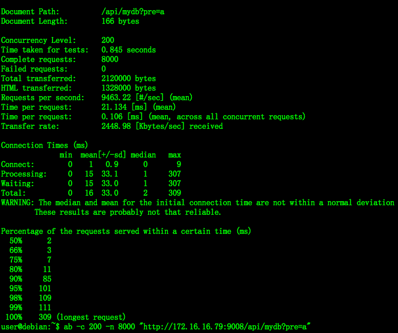

# mydb
## 简介 
mydb是一个可持久化的大容量硬盘版的redis存储服务，兼容string、json 数据格式的接口([兼容详情]，解决redis由于存储数据量巨大而导致内存不够用的容量瓶颈，可以当做一个大容量的 HashMap 来用。

## mydb用户

    
    


## 特点
* 容量大，支持百G数据量的存储
* 在线WEB监控
* 方便的 Restfull 接口
* 方便的key 前缀检索


## 快速试用
  如果想快速试用mydb，需要 jdk8环境。

```
# 1. 解压文件
tar zxf mydbX.Y.Z_bin.tar.gz
# 2. 运行目录
cd mydbX.Y.Z
# 3. 运行mydb:
sh start.sh
```

## 编译安装

1.下载安装 jdk8,下载源文件；：

```
    git clone https://github.com/supermy/rocksdb-service
```

2.安装 maven，编译打包：

```
     mvn -DskipTests=true package
```

3.切换的 shell目录：

```
	 sh start.sh 运行
```
4.观察输出日志

```
	tail -f mydb.log
```


## 使用
```
	./nohup java -Xmx1024m -Xss1024m -jar ../target/rocksdb-service-0.1.0.jar \
              --spring.config.location=../src/main/resources/application.yml > mydb.log 2>&1 &

```
    若启动失败，通过修改 application.yam，重新设置启动端口，已经数据库的保存路径

    restful 支持 json
    
    单个数据处理
    
    put:curl -XPUT "http://172.16.16.79:9008/api/mydb/abc" -d '{"a"=12,"b"=c}'
    get:curl http://172.16.16.79:9008/api/mydb/abc
    del:curl -XDELETE "http://172.16.16.79:9008/api/mydb/abc"
    
    批量数据处理
    
    post: curl -XPOST "http://172.16.16.79:9008/api/mydb" -d  '{a:{"a":1},b:{b:1}}'
    get:  curl "http://172.16.16.79:9008/api/mydb?pre=a"  根据前缀查询 key

```


## 性能

### 测试环境：
```
	相同配置服务端、客户机各一台：
	处理器：24核 Intel(R) Xeon(R) CPU E5-2630 v2 @ 2.60GHz
	内存：165157944 kB
	操作系统：CentOS release 6.2 (Final)
	网卡：Intel Corporation I350 Gigabit Network Connection
```
### 测试接口：
```
	
```

### 测试方法：
```
	ab -c 200 -n 8000 "http://172.16.16.79:9008/api/mydb?pre=a" 
```

### 测试结果：
```
   
```


## 文档
1. [Wiki] (https://)

## 联系方式

QQ群：201108549